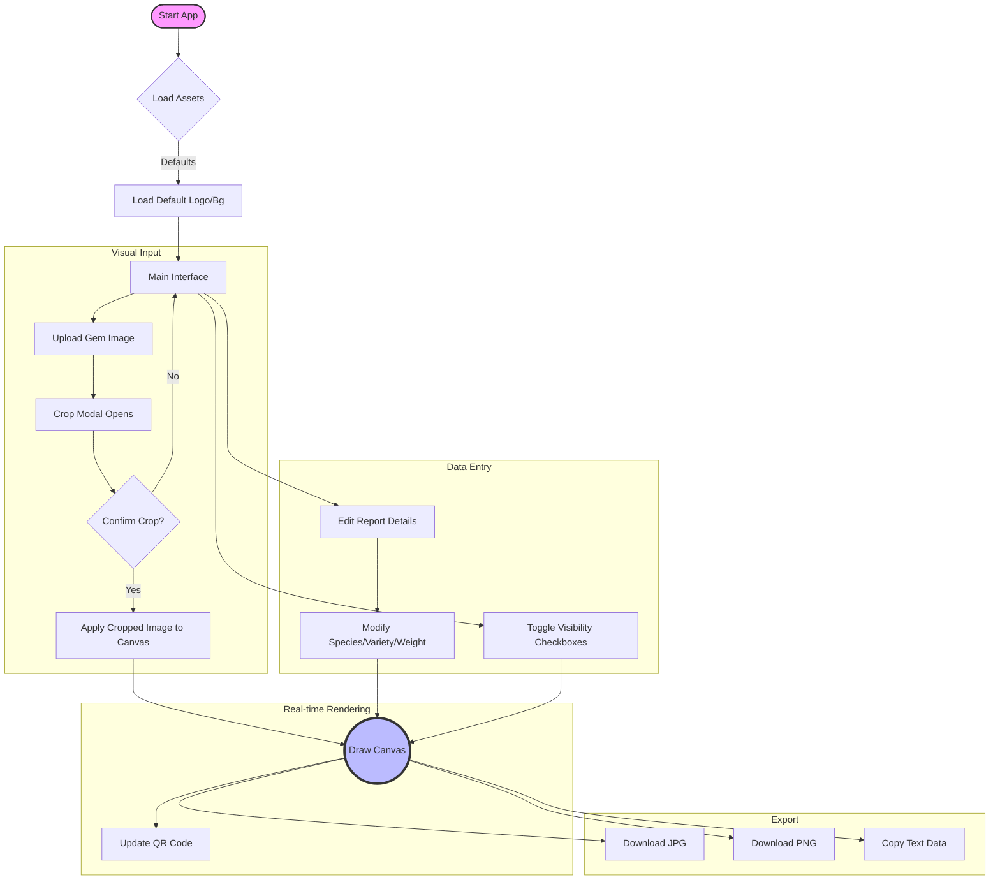

# 💎 GemEditor Pro

**GemEditor Pro** is a single-file, offline-capable web application designed for Gemological Laboratories. It allows users to generate professional, high-resolution report cards (certificates) for gemstones using the HTML5 Canvas API.

---

## 🚀 1. Application User Flow
This diagram illustrates the step-by-step process a user follows to create a report.

🎨 3. The Canvas Rendering Stack
The draw() function builds the final image by stacking layers on top of each other, similar to Photoshop.

Layer Order (Bottom to Top):

🔲 Background Layer (Image or White fill)

📝 Header Text (Brand Name, Subtitles)

🏢 Logo (Top Left)

💎 Gemstone Image (Cropped, placed in box)

📊 Data Rows (Report #, Species, Weight, Dimensions)

🔬 Comments (Microscopic findings)

🔳 QR Code (Generated dynamically)

✒️ Footer (Declaration/Signature)

🧠 4. Logic & State Management
How the app handles updates:

User Action: User types "Blue Sapphire" in the input box.

Event Trigger: The input event fires in JavaScript.

Data Gathering: The App collects values from all 12 input fields.

Clear Canvas: ctx.clearRect() wipes the previous drawing.

Re-Draw: The app instantly redraws all 8 layers with the new text.

QR Update: The app generates a new QR code based on the new text and draws it.

Result: The user sees the certificate update instantly.

🛠️ Features
Real-time Preview: Changes in the sidebar reflect immediately on the certificate.

Image Cropping: Integrated Cropper.js to ensure gemstone photos are perfectly square and focused.

Dynamic QR Codes: Automatically generates a verification QR code containing the report summary.

Toggleable Fields: Checkboxes allow users to hide/show specific rows (e.g., hide "Microscopic Comments" if not needed).

High-Res Export: Downloads the canvas as JPG or PNG.

Offline Mode: Works entirely in the browser without a backend server.

💻 Usage
Open: Simply double-click index.html to open it in any modern web browser (Chrome, Firefox, Edge).

Customize:

Upload your Logo and a Background design (optional).

Upload a Gemstone Photo and use the cropper tool.

Edit Data: Fill in the report number, weight, species, etc., on the right sidebar.

Export: Click Save JPG to download the final report card.

📦 Dependencies
The app expects the following libraries (linked via CDN in the code). If running offline without internet, ensure these files are in the same directory:

tailwindcss.js (Styling)

fontawesome.css (Icons)

cropper.min.css / cropper.min.js (Image Cropping)

qrious.min.js (QR Code Generation)
